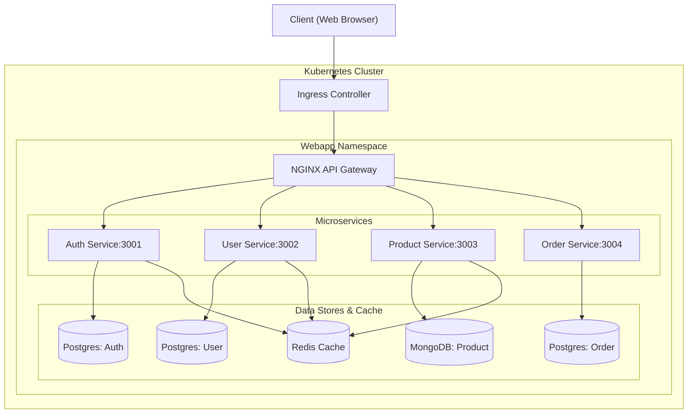

# Kubernetes Microservices Deployment
[](https://opensource.org/licenses/MIT)
A complete Docker-based microservices architecture orchestrated with Kubernetes. This project demonstrates a modern, scalable web application infrastructure with four independent microservices, each with its own database, connected through an API Gateway.

## 📋 Table of Contents

- [Architecture Overview](#-architecture-overview)
- [Services](#-services)
- [Prerequisites](#-prerequisites)
- [Quick Start](#-quick-start)
- [Manual Deployment](#-manual-deployment)
- [Accessing the Application](#-accessing-the-application)
- [API Endpoints](#-api-endpoints)
- [Monitoring](#-monitoring)
- [CI/CD Pipeline](#-cicd-pipeline)
- [Troubleshooting](#-troubleshooting)
- [Cleanup](#-cleanup)

## 🏗️ Architecture Overview

This project implements a microservices architecture using Kubernetes for orchestration. The system consists of independent services that communicate through REST APIs, with each service having its own dedicated database.

## 🔧 Services

| Service | Technology | Port | Database | Description |
|---------|------------|------|----------|-------------|
| **API Gateway** | Nginx | 80 | - | Routes requests to appropriate services |
| **Auth Service** | Node.js/Express | 3001 | PostgreSQL | Handles user authentication and JWT tokens |
| **User Service** | Node.js/Express | 3002 | PostgreSQL | Manages user profiles and data |
| **Product Service** | Node.js/Express | 3003 | MongoDB | Handles product catalog and inventory |
| **Order Service** | Node.js/Express | 3004 | PostgreSQL | Manages orders and transactions |
| **Redis** | Redis | 6379 | - | In-memory data store for caching |
| **PostgreSQL** | PostgreSQL | 5432 | - | Relational databases for services |
| **MongoDB** | MongoDB | 27017 | - | NoSQL database for product data |
## 📋 Prerequisites
Before deploying, ensure you have:

 - Kubernetes Cluster: Minikube, Docker Desktop Kubernetes, or cloud Kubernetes service

 - kubectl: Kubernetes command-line tool

 - Docker: For building container images

 - Git: For cloning the repository

## 🚀 Quick Start
Automated Deployment
```bash
# Clone the repository
git clone https://github.com/your-username/kubernetes-microservices.git
cd kubernetes-microservices

# Make scripts executable
chmod +x scripts/deploy.sh
chmod +x scripts/teardown.sh

# Deploy the entire stack
./scripts/deploy.sh
```
 Manual Deployment
```bash
# Step 1: Create namespaces
kubectl apply -f k8s/namespaces.yaml

# Step 2: Create secrets (update with your actual secrets first)
kubectl apply -f k8s/secrets/

# Step 3: Create config maps
kubectl apply -f k8s/configs/

# Step 4: Create persistent volumes
kubectl apply -f k8s/volumes/

# Step 5: Create deployments
kubectl apply -f k8s/deployments/

# Step 6: Create services
kubectl apply -f k8s/services/

# Step 7: Create ingress
kubectl apply -f k8s/ingress/
```
## 🌐 Accessing the Application
After deployment, access the application:
```bash
# Get the Minikube IP
minikube ip

# Get the NGINX service URL
minikube service nginx -n webapp --url

# Access via ingress (add to /etc/hosts)
echo "$(minikube ip) your-domain.com" | sudo tee -a /etc/hosts
```
Then open: http://your-domain.com
## 📡 API Endpoints
| Service | Endpoint | Description |
|---------|----------|-------------|
| **Auth** | `GET /api/auth/health` | Health check |
| **Auth** | `POST /api/auth/register` | User registration |
| **Auth** | `POST /api/auth/login` | User login |
| **Users** | `GET /api/users/health` | Health check |
| **Users** | `GET /api/users` | Get all users |
| **Products** | `GET /api/products/health` | Health check |
| **Products** | `GET /api/products` | Get all products |
| **Orders** | `GET /api/orders/health` | Health check |
| **Orders** | `POST /api/orders` | Create new order |
## 📊 Monitoring
The deployment includes Prometheus monitoring annotations. To set up monitoring:

```bash
# Deploy Prometheus
kubectl apply -f https://raw.githubusercontent.com/prometheus-community/helm-charts/main/charts/prometheus/values.yaml -n monitoring

# Deploy Grafana
kubectl apply -f https://raw.githubusercontent.com/grafana/helm-charts/main/charts/grafana/values.yaml -n monitoring

# Access Grafana dashboard
kubectl port-forward -n monitoring service/grafana 3000:3000
```
## 🔄 CI/CD Pipeline
This repository includes GitHub Actions workflow that:

 - Validates Kubernetes manifests on pull requests
 - Deploys to Kubernetes on pushes to main branch

To set up CI/CD:
 - Add your Kubernetes config as a secret named KUBE_CONFIG
 - Update image names in deployment files to use your container registry
 - Push changes to trigger the workflow

## 🐛 Troubleshooting
Common Issues
 - Image pull errors: Update image names in deployment files
 - Connection refused: Ensure Kubernetes cluster is running
 - PVC pending: Check storage class availability

## Useful Commands
```bash
# Check pod status
kubectl get pods -n webapp

# View pod logs
kubectl logs -f <pod-name> -n webapp

# Describe resource details
kubectl describe pod <pod-name> -n webapp

# Check service status
kubectl get svc -n webapp

# Check ingress status
kubectl get ingress -n webapp

# View events
kubectl get events -n webapp --sort-by=.metadata.creationTimestamp
```
## 🧹 Cleanup
To remove the entire deployment:

```bash
# Using the teardown script
./scripts/teardown.sh

# Or manually delete all resources
kubectl delete -f k8s/ingress/
kubectl delete -f k8s/services/
kubectl delete -f k8s/deployments/
kubectl delete -f k8s/volumes/
kubectl delete -f k8s/configs/
kubectl delete -f k8s/secrets/
kubectl delete -f k8s/namespaces.yaml
```
# Delete Minikube cluster
```bash
minikube delete
```
Note: Remember to update the Docker image names in the deployment files and replace the app-secrets with your actual base64-encoded values before deployment.
## 📝 License
This project is licensed under the MIT License. See LICENSE file for details.
